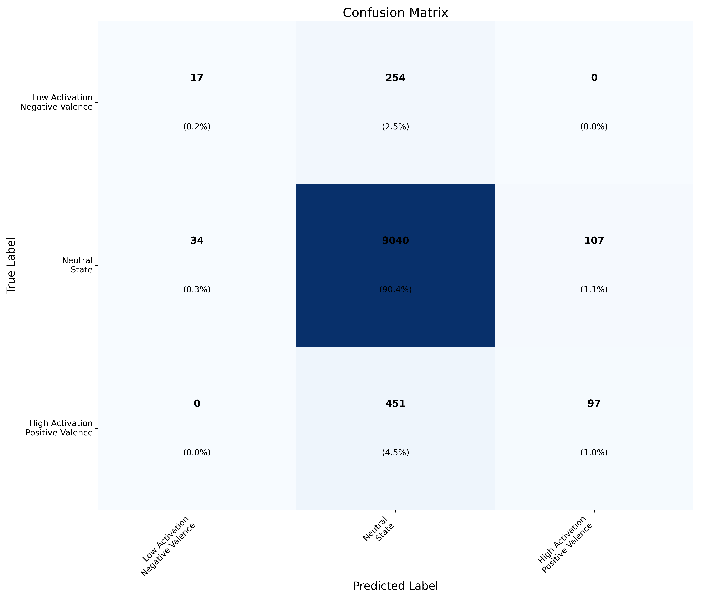
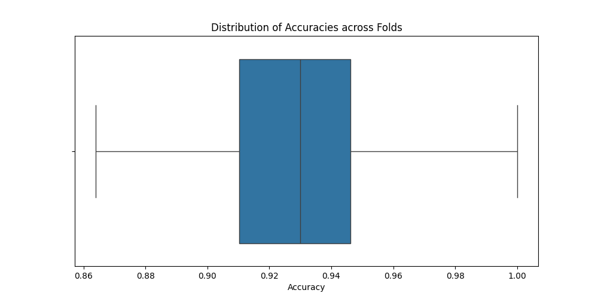
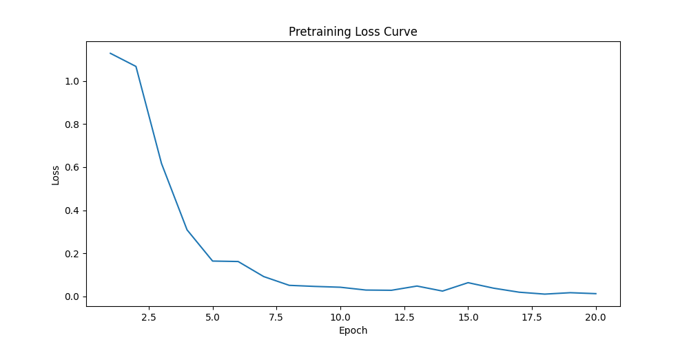

# Exploratory Transformer Experiments on Wearable Biosignals

This repository is a self-directed exploratory project to start learning how to work with physiological signals using transformer-based multimodal models.

It is loosely inspired by the paper *Transformer-Based Self-Supervised Multimodal Representation Learning for Wearable Emotion Recognition*, but it is **not** a faithful reproduction of the original method. The current implementation uses EDA, BVP, and TEMP signals from the *In-Gauge and En-Gage* dataset and assigns synthetic proxy labels through simple hand-crafted rules.

The goal of this repository is to explore preprocessing, multimodal time-series modeling, and evaluation workflow. It should be understood as a learning and experimentation project, not as a validated emotion recognition system.

## What this repository currently does

- Loads EDA, BVP, and TEMP signals from the *In-Gauge and En-Gage* dataset
- Applies a simplified multimodal sequence model inspired by transformer-based approaches
- Uses synthetic proxy labels instead of validated emotional annotations
- Produces exploratory training outputs and visualizations

## Main limitations

- This is not a faithful reimplementation of the original paper
- It does not use real emotion labels
- It only uses three physiological modalities
- The architecture and training setup are simplified
- The reported results should not be interpreted as performance on real emotion recognition

## Dataset

Download the dataset with:

```bash
wget -r -N -c -np https://physionet.org/files/in-gauge-and-en-gage/1.0.0/
```

## Exploratory results

The current run produced the following internal results:

- Mean accuracy: `0.9355539986896816`
- Std accuracy: `0.03889275184490556`

These numbers should be treated with caution. Since the target labels are synthetic and derived from the input signals through heuristic rules, the reported accuracy is only useful as a sanity check for the pipeline. It is not comparable to results on real supervised emotion recognition tasks.

## Visualizations

### Confusion Matrix


### Accuracy Distribution


### Pretraining Loss


## Citation

If you use or inspect this repository, please cite the dataset and the paper that motivated the exploration:

**Dataset**

Gao, N., Marschall, M., Burry, J., Watkins, S., & Salim, F. (2023). *In-Gauge and En-Gage: Understanding Occupants' Behaviour, Engagement, Emotion, and Comfort Indoors with Heterogeneous Sensors and Wearables* (version 1.0.0). PhysioNet.

**Inspiration paper**

Wu, Y., Daoudi, M., & Amad, A. (2023). *Transformer-based self-supervised multimodal representation learning for wearable emotion recognition*. IEEE Transactions on Affective Computing, 15(1), 157-172.

