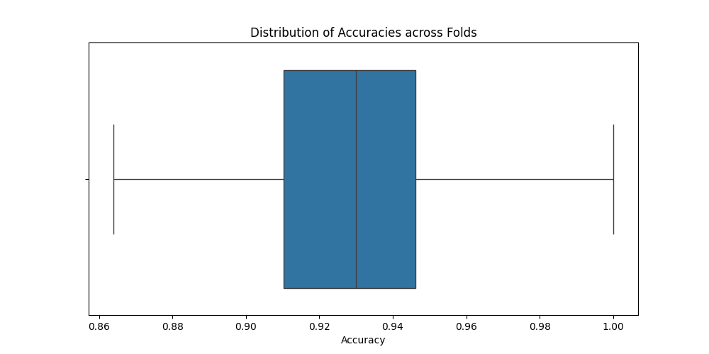

# Transformer-Based Self-Supervised Multimodal Emotion Recognition

This project implements a preliminary version of the paper "Transformer-Based Self-Supervised Multimodal Representation Learning for Wearable Emotion Recognition" using EDA, BVP (similar to HR), and TEMP data with synthetically generated emotions.

## Key Differences from Original Paper

- Uses synthetically generated emotions instead of real emotional states
- Focuses only on EDA, BVP, and TEMP modalities
- Simplified model architecture and training process

## Results

Mean accuracy: 0.9355539986896816
Std accuracy: 0.03889275184490556

## Visualizations

### Confusion Matrix

### Accuracy Distribution

### Pretraining Loss

## Citation

Gao, N., Marschall, M., Burry, J., Watkins, S., & Salim, F. (2023). In-Gauge and En-Gage: Understanding Occupants' Behaviour, Engagement, Emotion, and Comfort Indoors with Heterogeneous Sensors and Wearables (version 1.0.0). PhysioNet.

Wu, Y., Daoudi, M., & Amad, A. (2023). Transformer-based self-supervised multimodal representation learning for wearable emotion recognition. IEEE Transactions on Affective Computing, 15(1), 157-172.
